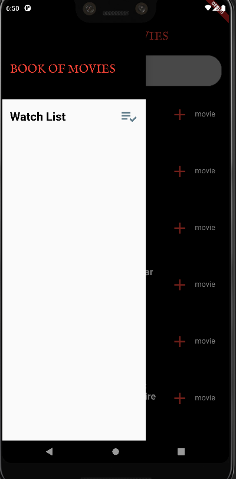

# movie-app

A Mobile App that would help users look up movies.

1.	The application created using Flutter.
2.	The application  utilize the available Restful APIs available at: https://www.omdbapi.com.
3.	The Mobile App provide the following screens:

**(Search for a Movie) Screen**

This is the application's main page. 

A Text box and Listview

The Text is used to enter the movie title to search for, the listview widget display the search result, each movie item in the listview display: 
1.	Movie Title
2.	Year
3.	Type
4.	Image

**(Movie details) Screen**

In the previous screen, if a movie item in the listview is tapped on (clicked) it display this screen, this screen  contain complete information on the Movie, which includes:

Title
Year
IMDB rating
Genre
Writer
Director
Actors
Plot
Image

Plot displayed above is a short plot, when tapped on will display long plot.

**(Watch List Movies) Screen**

Users can select from the search results in the first screen and add to their watch list which accessible using the drawer menu
Movies added to the Watch List saved locally in SQLite database.

**(Movies Genre) Screens**

Movies added to the Watch list screen can be categorized using their genre, each genre should have a separate screen

**(Search Watch List) Screen**

In this screen, users can search their watch list using title, genre, year, or rating.

used technologies : flutter, SQLite
